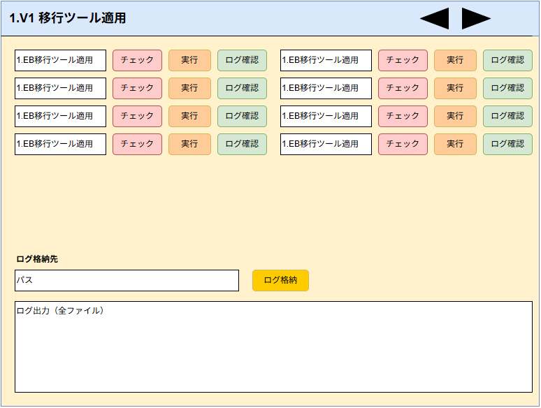

# 1.V1 移行ツール適用 画面設計書（ドラフト）

## 1. 画面概要
- **画面名**: 1.V1 移行ツール適用
- **目的**: V1環境から新環境への移行ツールを適用する際の、基本的な環境パス設定およびバッチ実行を管理・操作する画面。

## 2. 画面レイアウト構成（上部エリア）
- **共通パス設定要素**:
  - `SourcePath` (移行元パス)
  - `DestinationPath` (移行先パス)
  - `LogStoragePath` (ログ格納パス1)
  - `LogStoragePath2` (ログ格納パス2)
- **全体実行ボタン機能**:
  - ログ格納用バッチ実行ボタン
  - ログ集約用バッチ実行ボタン

## 3. プロセス単位の構成（下部一覧エリア）
各プロセス（行）ごとに、処理の実行およびログ確認を行う。

- **基本的な要素**:
  - プロセス名
  - [実行]ボタン (紐付けられた複数のバッチファイルを順次実行)
  - [ログ確認]ボタン (指定されたログ出力先ディレクトリを開く)
- **主要なプロセス例**:
  - 「新規プロセス000」 (チェック用バッチ、実行用バッチ 等)
  - 「新規プロセス2」
