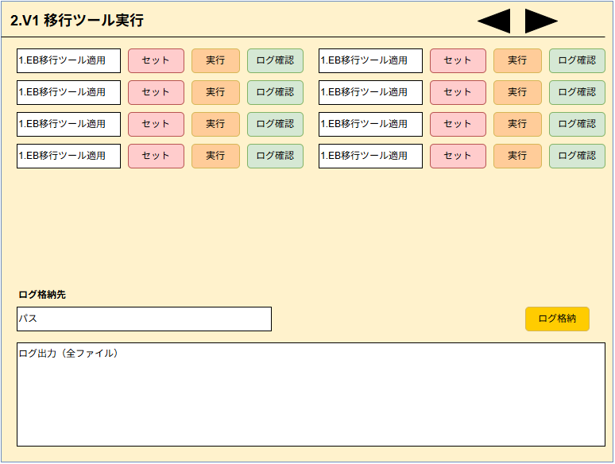

# 2.V1 移行ツール実行 画面設計書（ドラフト）

## 1. 画面概要
- **画面名**: 2.V1 移行ツール実行
- **目的**: V1移行に向けた各種中核プロセス（バッチ処理）の実行基盤を提供する画面。

## 2. 画面レイアウト構成（上部エリア）
- **共通パス設定要素**:
  - `SourcePath` / `DestinationPath` (枠組みとして存在、未設定状態)
  - `LogStoragePath` (ログ格納パス1)
  - `LogStoragePath2` (ログ格納パス2)

## 3. プロセス単位の構成（下部一覧エリア）
各プロセスで実行ボタンとログ確認ボタンを備え、バッチが割り当てられる。

- **主要なプロセス例**:
  - 「プロセス①」
    - サンプルバッチや `gradlew.bat` 用の実行を担う。
    - 固有の出力先 (`C:\work\iko_gui\logs`) を持つ。
  - 「新規プロセス」枠
    - 拡張用として複数設定済み。
