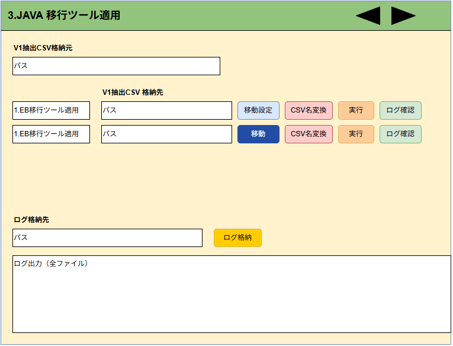

# 3.java移行ツール実行 画面設計書（ドラフト）

## 1. 画面概要
- **画面名**: 3.java移行ツール実行
- **目的**: Javaベースの移行ツール実行、および関連する後続処理を操作する画面。

## 2. 画面レイアウト構成（上部エリア）
- **共通パス設定要素**:
  - `SourcePath` (移行元パス)
  - `LogStoragePath` (ログ格納パス1)
  - `LogStoragePath2` (ログ格納パス2)

## 3. プロセス単位の構成（下部一覧エリア）
プロセス固有の `DestinationPath`（個別出力先パス）などの拡張項目を持つ。

- **主要なプロセス例**:
  - 「1.EB移行ツール適用（ページ2）」
    - 複数の実行バッチ (`run.bat`, `gradlew.bat`)
    - 個別の DestinationPath および LogOutputDir
  - 「2.EB移行ツール適用（ページ2）」
    - サンプルバッチ実行用。
