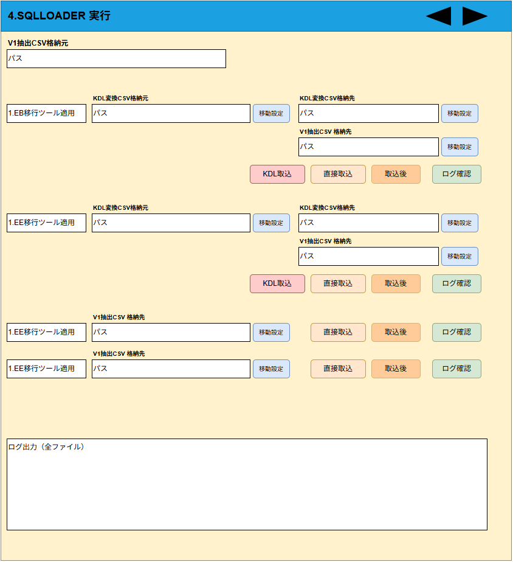

# 4.SQLLOADER 実行 画面設計書（ドラフト）

## 1. 画面概要
- **画面名**: 4.SQLLOADER 実行
- **目的**: SQL*Loaderを使用したデータ取込プロセスおよび各環境（EB, EE, ECなど）向けメンテ用バッチを管理・実行する画面。

## 2. 画面レイアウト構成（上部エリア）
- **共通パス設定要素**:
  - `SourcePath` (移行元パス)
  - `LogStoragePath` (ログ格納パス1)
  - `LogStoragePath2` (ログ格納パス2)
- **全体実行ボタン機能**:
  - ログ格納用バッチ実行ボタン

## 3. プロセス単位の構成（下部一覧エリア）
他の画面よりも複雑で、各プロセス（行単位）に固有のパス設定（KdlSourcePath等）を持つなど、データロードに特化したレイアウト構成。

- **主要なプロセス例**:
  - 「1.EB SQLLOADER実行」
    - 固有パス: `KdlSourcePath`, `KdlDestPath`, `V1CsvDestPath`
    - 実行バッチの構成が多段式 (最大6スロット構成: 取込用、メンテEA用、EB用など)
  - 「1.EE SQLLOADER実行」
    - 上記と同様に専用のディレクトリとバッチの組み合わせを持つ。
  - 「1.EC SQLLOADER実行」
    - 専用バッチ群（KDL取込、直接取込、取込後、メンテ、予備）の構成。
