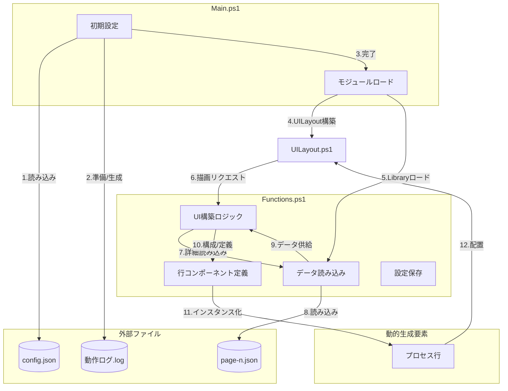
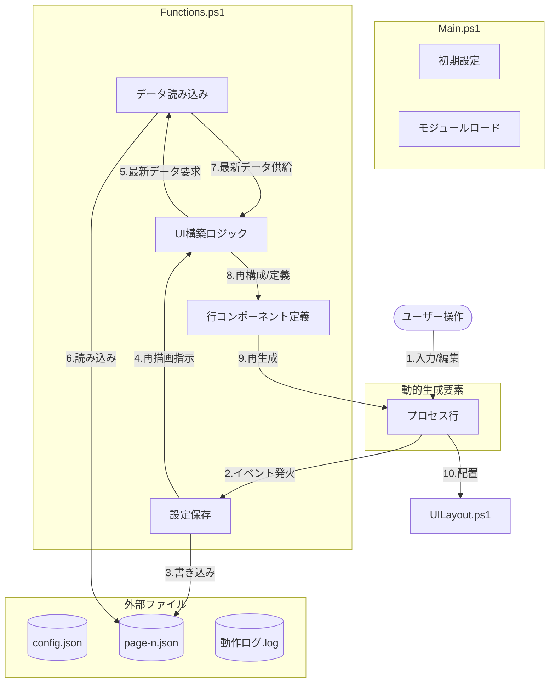

# Functions.ps1 プログラム構成解説

`Functions.ps1` は、本アプリケーションにおける **ビジネスロジック層** および **動的UI構築（コンポーネント・ファクトリ）層** を担うモジュールです。

## 1. プログラム構成概略図

以下の概略図では、状況に応じた「処理の流れ」を可視化しています。

### ① 初期表示フロー
アプリ起動やページ遷移時に、グローバル設定やログファイルを準備した上で画面を組み立てる流れです。

---

### ② 設定変更・保存フロー
ユーザーが画面上で設定を変更し、それが永続化されてUIに再反映される流れです。

---

## 2. 図解コンポーネントの詳細解説

概略図に登場する各要素名に対応した役割を解説します。

### ■ 初期設定 (Init) / モジュールロード (LoadModules)
`Main.ps1` 内で行われる、アプリケーション起動時の根本的な処理です。
- **初期設定 (Init)**: `config.json` を読み込み、全体のページ構成を確定させるとともに、本日の「動作ログ.log」ファイルを準備します。
- **モジュールロード (LoadModules)**: `UILayout.ps1` と `Functions.ps1` をセッションに読み込みます。

### ■ UILayout.ps1 (Frame)
アプリケーションの「静的な外枠」を担うGUI部品です。
- メインウィンドウ、固定配置のヘッダー・フッター、および動的コンテンツ用のパネル（`processPanel`）を管理します。

### ■ データ読み込み (Load) / 設定保存 (Save)
`Functions.ps1` が担うデータマネジメント機能です。
- **データ読み込み (Load)**: 「どのボタンを幾つ出すか」といった具体的な中身情報を `page-n.json` から取得します。
- **設定保存 (Save)**: ユーザーが画面上のテキストボックス等を編集した際、その変更内容を `page-n.json` に書き込みます。

### ■ UI構築ロジック (Build) / 行コンポーネント定義 (CompDef)
`Functions.ps1` が担うUI生成機能（コンポーネント・ファクトリ）です。
- **UI構築ロジック (Build)**: `Update-ProcessControls` 関数が、画面中央のパネルを更地にした上で、最新データに基づいて画面を再構築する全体の指揮を執ります。
- **行コンポーネント定義 (CompDef)**: 具体的な「ボタン」「チェックボックス」「入力欄」といった各行のパーツが、画面上のどの座標に、どのサイズで、どのような機能（イベント）を持って配置されるべきかの詳細な定義を保持しています。

### ■ プロセス行 (Comp)
- `Functions.ps1` によって「実行時（ランタイム）」に組み上げられた、実際のUI部品群の実体です。

---

## 3. 処理フェーズ詳細（初期表示フローの番号に対応）

図中のフロー番号（1〜12）に沿った、物理的な挙動の解説です。

| 番号 | 工程 | 内 容 |
|:---:|---|---|
| 1 | **初期設定 (Init)** | 外部ファイルの `config.json` を読み込む。 |
| 2 | **初期設定 (Init)** | `動作ログ.log` を生成し、記録を開始する。 |
| 3 | **モジュールロード** | `LoadModules` を経て、UIとロジックの準備を完了する。 |
| 4 | **UILayout構築** | `UILayout.ps1` が起動し、空のメインウィンドウ（`Frame`）を作る。 |
| 5 | **Libraryロード** | `Functions.ps1` が読み込まれ、各種関数が利用可能になる。 |
| 6 | **描画リクエスト** | `Frame` から `Build` に対し、「中身」の描画が要求される。 |
| 7 | **詳細読み込み** | `Build` が `Load` に対し、プロセスの詳細情報を要求する。 |
| 8 | **読み込み** | `Load` が外部ファイルの `page-n.json` を読み込む。 |
| 9 | **データ供給** | 読み込まれた各行の設定値が `Load` から `Build` へ渡される。 |
| 10 | **構成/定義** | `Build` が `CompDef` を参照し、各ボタンや入力欄の配置位置を決める。 |
| 11 | **インスタンス化** | `CompDef` の設計に基づき、実体（`Comp`）が生成される。 |
| 12 | **配置** | 生成された `Comp` が `Frame` のパネルに配置され、描画が完成する。 |
 stone
